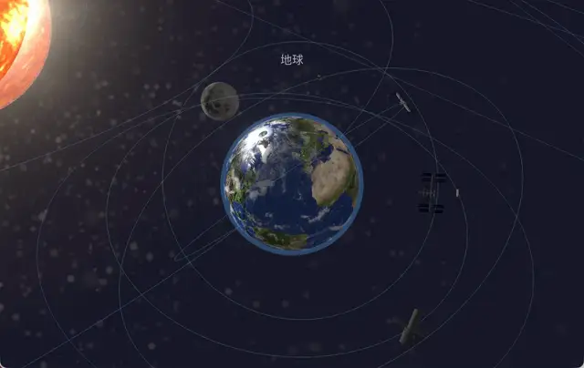
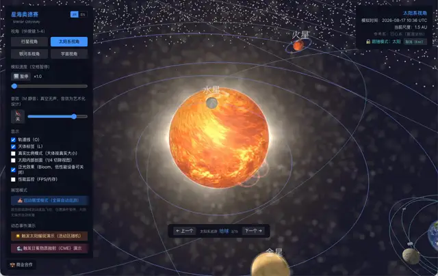
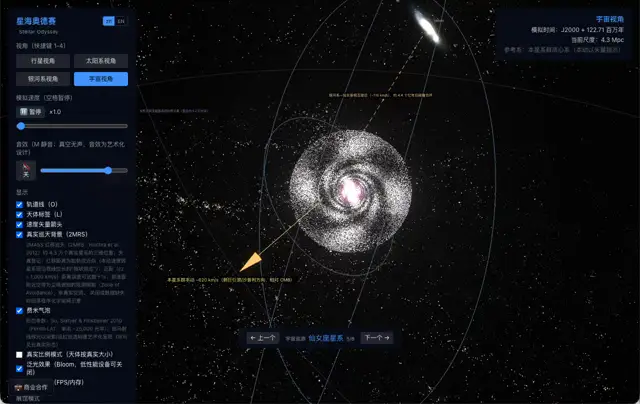
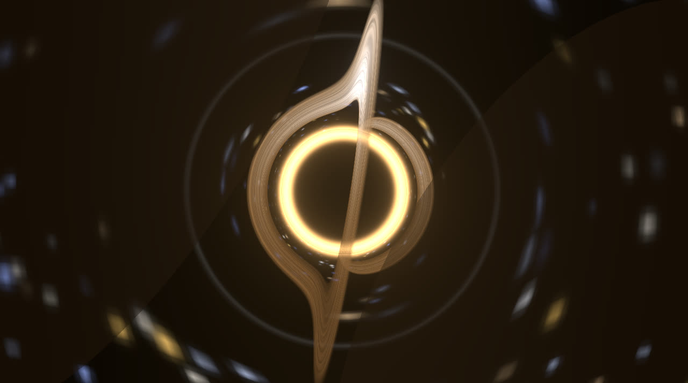
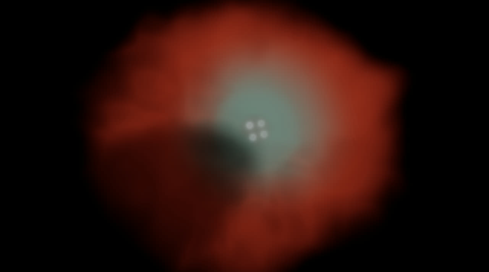
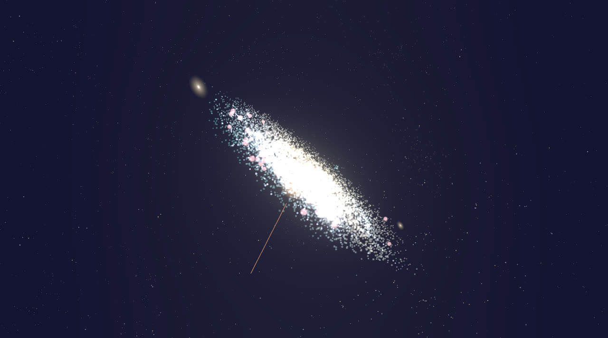

# 🌌 Stellar Odyssey

[中文](./README.md) | **English**

> **A scroll-wheel journey from a planet's surface to the edge of the observable universe.**
> A multi-scale 3D visualization of celestial motion built with React + Three.js: a solar system driven
> by real Keplerian orbits, volumetric emission nebulae and gravitationally lensed black holes, galaxy
> close-ups baked from public-domain astronomical imagery, and a large-scale cosmic backdrop of 43,000+
> real galaxies — four zoom levels seamlessly connected by the scroll wheel, with scale-adaptive spatial
> audio. A science-data-driven, immersive tour of the cosmos. **Fully bilingual (English / Chinese) UI,
> 3D labels, and science notes.**

<p align="center">
  <a href="https://stellar.guushu.com/?lang=en"><strong>🚀 Try it live → stellar.guushu.com</strong></a>
</p>

[](https://stellar.guushu.com/?lang=en) [](https://github.com/HowardZlh/stellar-odyssey/actions/workflows/pr-gate.yml)      

> Launch with [`?lang=en`](https://stellar.guushu.com/?lang=en) for the English UI, or use the **zh/EN
> toggle** at the top of the control panel at any time — the interface, 3D body labels, and science
> notes all switch instantly.

**Contents**: [Demos](#-demos) · [Highlights](#-highlights) · [Quick Start](#-quick-start) · [Docs](#-documentation) · [Tech Stack](#-tech-stack) · [Scientific Integrity](#-scientific-integrity) · [Contributing](#-contributing) · [Supporter Unlock](#-supporter-unlock) · [Sponsor](#-sponsor) · [Commercial](#-commercial-partnership) · [License](#️-license)

---

## 🎬 Demos

**Continuous four-level zoom journey** — scroll out from an Earth close-up, through the Solar System and the Milky Way, all the way to the edge of the observable universe:



> 🎬 [Watch the 60fps video (1280px MP4, 7.6 MB)](https://github.com/HowardZlh/stellar-odyssey/releases/download/v0.1.2/zoom-journey-60fps.mp4)

**Solar activity event chain** — trigger a solar flare, fly in to see granulation and sunspots, then watch a coronal mass ejection (CME) race toward Earth:



> 🎬 [Watch the 60fps video (1280px MP4, 9.3 MB)](https://github.com/HowardZlh/stellar-odyssey/releases/download/v0.1.2/solar-events-60fps.mp4)

**Milky Way–Andromeda merger fast-forward preview** — 4.5 billion years in about twelve seconds, from first passage through tidal distortion to the final merger:



> 🎬 [Watch the 60fps video (1280px MP4, 10 MB)](https://github.com/HowardZlh/stellar-odyssey/releases/download/v0.1.2/galaxy-merger-60fps.mp4)

| Sgr A* lensed photon ring | Volumetric Orion Nebula | Andromeda close-up (DSS2-driven) |
|---|---|---|
|  |  |  |

> And that's just three storylines. **Zoom into Sagittarius A\* to see the photon ring of a
> gravitationally lensed black hole, dive inside the volumetric Orion Nebula, fly to an Andromeda
> galaxy driven by real survey imagery, and look around the cosmic web amid 43,000+ real galaxies** —
> see the highlights below, or [just start playing](https://stellar.guushu.com/?lang=en).

---

## ✨ Highlights

### 🔭 Continuous four-level zoom
- **Planet → Solar System → Milky Way → Universe**: switch with keys `1`–`4`, or simply **scroll from a planet's surface out to the observable-universe boundary** (~46.5 billion light-years radius) with no mode switches
- Content LOD cross-fades, logarithmic time-compression interpolation, background color and soundscape blending, plus a HUD scale ruler (AU / light-years / Mpc auto-switching)

### 🪐 A physically driven Solar System
- All eight planets use **full Keplerian orbital elements** (NASA JPL data) with Kepler's equation solved for equal-area motion; initial phases from the J2000 epoch — **planet positions match the real current date on launch**
- Venus's retrograde spin, Uranus's 97.8° tilt, Halley's Comet on its 162° retrograde high-eccentricity orbit, asteroid/Kuiper belts with per-particle Keplerian shear
- 20+ satellites: tidally locked Moon, Galilean 1:2:4 resonance, detailed glTF models of the ISS, Hubble, and Tiangong

### ☀️ Solar activity
- Close-up granulation, sunspots (11-year butterfly-diagram migration), prominences, faculae; differential rotation (25.4 d equator / 34 d poles)
- **Flare and CME event chain**: Poisson auto-trigger + manual demo; CME arrival enhances Earth's aurorae
- **Solar interior cutaway** with clickable core / radiative / convective layers

### 🌀 The Milky Way and deep space
- 3D barred-spiral structure (43k-particle disk + density-wave arms + dust lanes + halo + **HI warp**), with the Solar System orbiting the galactic center ("You are here" marker)
- 20+ special objects modeled on real prototypes: Sagittarius A*, the Crab pulsar's lighthouse beams, the Sirius binary, the Orion Nebula, the Pleiades, the Horsehead Nebula, quasar 3C 273…
- **Supernova explosions** (four-stage Sedov–Taylor animation) and a **vertical-expansion mode** (`V`) that morphs the disk into an ellipsoid to reveal true galactic-latitude distribution

### 🕳 Volumetric nebulae and lensed black holes
- **Raymarched volumetric nebulae** (emission–absorption integration + 3D density textures + blue-noise dithering): Orion M42's ionization cavity, the Ring Nebula M57's shell, the Horsehead's absorption silhouette, the Crab's filaments with pulsar wind torus/jets, WR 124's ejecta shell
- **Black-hole lensing close-ups**: photon ring, background starfield bending, accretion-disk blackbody color + Doppler beaming + gravitational redshift at Sgr A* / Cygnus X-1; following M87 reproduces the near-face-on photon ring of the **2019 EHT image**
- **Physically based stellar surfaces**: Planck blackbody colors, spectral-type limb darkening, time-varying convective granulation, Betelgeuse's asymmetric giant convection cells
- **Adaptive quality tiers**: volumetric rendering auto-scales step count and render-target resolution with measured FPS

### 🎞 Galaxies driven by real astronomical data (offline baking pipeline)
- **Imagery-driven close-ups**: M31/M33/LMC/SMC baked from DSS2 color survey imagery into density/color/dust maps — spiral arms, dust lanes, and star-forming regions match real photographs (M31 deprojected at 77° inclination)
- **Volumetric dust-lane extinction**: viewed at an angle, M31's near-side dust truly occludes starlight behind it
- **2MRS real survey backdrop**: a 3D point cloud of 43,488 real galaxies (2MASS Redshift Survey, Huchra et al. 2012) — the Virgo cluster, the zone of avoidance, and cosmic-web filaments are all real data
- **Pleiades from Gaia DR3** (600 members) + M13 with a King profile and HR-diagram colors
- More real prototypes: the M87 cluster environment, LMC's 30 Doradus, the Antennae's N-body tidal tails, Abell 370-style lensing arcs, GRB 221009A, the Milky Way's **Fermi bubbles**

### 🌠 Cosmic scales
- Local Group → Virgo Cluster → Laniakea → large-scale structure; Hubble expansion, the Magellanic Stream, the observable-universe boundary
- **Milky Way–Andromeda merger preview**: 4.5 billion years in 12 seconds, ending in the elliptical galaxy "Milkomeda"

### 🖥 Kiosk mode & deep links
- **Kiosk mode**: one click in the control panel or launch with `?mode=kiosk` — a fullscreen self-running tour that flies from station to station; any visitor input pauses it and reveals the UI, and it resumes automatically after a short idle period; `tour=all` rotates through all four levels from the inside out
- **Deep links**: `?body=jupiter` opens the app flying straight to any body; single-body Observatory pages open directly via `/lab/observatory/<body-id>`; `?lang=en` presets the language; `?logo=` injects a partner logo (https only, stays visible while the UI is hidden) — all parameters combine freely, see [docs/en/launch-params.md](docs/en/launch-params.md)
- Press `H` to hide the entire UI for clean screenshots, recordings, and projection

### 🎧 Immersive experience
- **Procedurally synthesized spatial audio** (Web Audio): four-level soundscapes cross-mixed while zooming; 3D-positioned solar roar and black-hole hum (space is silent — the audio is registered as artistic design)
- Click any body to **fly to and follow** it (2.5 s smooth camera move); `[` / `]` steps through per-level tour sequences
- **Fully bilingual**: UI, 3D body labels, and science notes switch instantly with the zh/EN toggle (or launch with `?lang=en`)
- **True-scale mode** (`R`): honestly shows that planets are nearly invisible at real scale
- Scope-aware control panel, Bloom post-processing, 60 FPS target

---

## 🚀 Quick Start

**Online**: just visit [stellar.guushu.com/?lang=en](https://stellar.guushu.com/?lang=en) — nothing to install.

**Run locally**:

```bash
# Install dependencies
npm install

# Start the dev server (http://localhost:3000)
npm run dev

# Production build & serve
npm run build
npm run start
```

Once open: **scroll to zoom**, press `1`–`4` to switch levels, and **click any celestial body** to inspect and fly to it. Full controls are documented in [docs/en/controls.md](docs/en/controls.md).

> A modern browser with WebGL 2 is recommended (Chrome / Edge / Firefox / Safari).
> Phones and tablets are **fully supported**: rotate with one finger, pinch to zoom, and tap to
> select bodies. On small screens the interface automatically switches to a mobile layout (bottom
> tab bar + drawer panel), and rendering quality scales down to match device capability. See the
> "Touch Controls" section in [docs/en/controls.md](docs/en/controls.md) for details.

## 📖 Documentation

| Guide | Contents |
|---|---|
| [docs/en/getting-started.md](docs/en/getting-started.md) | Setup and a recommended first tour |
| [docs/en/view-guide.md](docs/en/view-guide.md) | What to see and do at each of the four levels |
| [docs/en/controls.md](docs/en/controls.md) | Complete controls & keyboard-shortcut reference |
| [docs/en/launch-params.md](docs/en/launch-params.md) | Launch URL parameters: deep links, kiosk deployment, logo/language |
| [docs/en/events-guide.md](docs/en/events-guide.md) | Dynamic events: flares / CMEs / supernovae / galaxy merger preview |
| [docs/en/meteor-shower-lab.md](docs/en/meteor-shower-lab.md) | Astronomy Lab: midsummer twin meteor showers guide (Perseids / kappa-Cygnids / 1966 Leonid storm) |
| [docs/en/science-notes.md](docs/en/science-notes.md) | Scientific integrity: real data sources & registered artistic liberties |
| [docs/en/unlock-guide.md](docs/en/unlock-guide.md) | Supporter Unlock: tiers & pricing, redemption channels, token usage, FAQ |
| [docs/en/how-it-works.md](docs/en/how-it-works.md) | Under the hood: multi-scale rendering, volumetrics, lensing, data baking |
| [docs/en/development.md](docs/en/development.md) | Development guide: architecture, testing, conventions |

Chinese originals live in [docs/](docs/).

## 🛠 Tech Stack

Next.js 16 · React 19 · TypeScript (strict) · Three.js / React Three Fiber · custom GLSL shaders (logarithmic depth buffer, raymarched volumes, gravitational lensing) · Zustand · Web Audio API (procedural synthesis, no audio asset files) · Tailwind CSS · Jest + React Testing Library (3,000+ tests, coverage gate ≥90%, enforced in CI) · offline data-baking pipeline (Gaia DR3 / SIMBAD / 2MRS / DSS2 → ~2.5 MB static artifacts, zero runtime external requests)

Curious how it works? See [docs/en/how-it-works.md](docs/en/how-it-works.md).

## 🔬 Scientific Integrity

All astrophysical parameters are based on real scientific data (NASA JPL, SIMBAD, NED, USGS Astrogeology, etc., with sources registered in code and in-app info panels); orbits use Kepler's laws; **every artistic liberty (size exaggeration, time compression, sound design…) is explicitly registered** in-app and in code comments. See [docs/en/science-notes.md](docs/en/science-notes.md).

## Attribution (summary)

- Star catalogs & survey data baked into `public/data/`: ESA **Gaia DR3** (Pleiades members), **2MASS Redshift Survey (2MRS)** (Huchra et al. 2012), **DSS2 color survey** imagery (STScI DSS / AAO / ROE / Caltech, cut via CDS hips2fits), **SIMBAD** and per-object literature, Harris globular-cluster catalog
- Planet/Moon/Sun textures: [Solar System Scope Textures](https://www.solarsystemscope.com/textures/) ([CC BY 4.0](https://creativecommons.org/licenses/by/4.0/), based on NASA data)
- Normal maps converted from NASA/USGS public-domain elevation data; dwarf-planet maps from NASA New Horizons / Dawn mosaics (public domain); satellite glTF models from NASA 3D Resources (public domain)

Full per-asset details, licenses, and registration notes: [docs/attribution.md](docs/attribution.md) (Chinese).

## 🤝 Contributing

Issues and PRs are welcome! Please read the [contributing guide](CONTRIBUTING.md) first — code contributions require signing the [CLA](CLA.md) (license-grant type; you keep the copyright of your contribution) to sustain the project's AGPL-3.0 + commercial dual-licensing model.

## 🔓 Supporter Unlock

Some advanced content (close-view detail layers / galaxy & universe tour sequences / unlimited event demos / unlimited access to the Astronomy Lab's Body Observatory) is available as a **time-limited supporter unlock**, while the free experience stays intact (all L1/L2 features and every far-view science note are unaffected, and the Observatory has a free daily quota). Tiers: **Week Pass ¥6 / Month Pass ¥15 / Year Pass ¥88** (Ko-fi reference: $1 / $2.5 / $13).

Support channels (in recommended order): **Alipay QR pay** (recommended — token issued automatically and access unlocks instantly after payment) → WeChat tip code (manual review, token sent by email) → Afdian (fallback, automatic order-number redemption) → Ko-fi (overseas fallback). Purchase and redeem at [stellar.guushu.com/unlock](https://stellar.guushu.com/unlock); full guide in [docs/en/unlock-guide.md](docs/en/unlock-guide.md). Supporter nicknames and messages (both optional) are listed on the donor roster and in the [Contributor Universe](https://stellar.guushu.com/contributors).

## 💖 Sponsor

If this universe ever made you pause your scroll wheel for a moment longer, consider supporting the project — supporting unlocks the advanced content (see "Supporter Unlock" above), and your nickname and message can join the contributor roster:

- 🔓 Unlock page (recommended entry: Alipay QR — token issued automatically and access unlocks instantly after payment): [stellar.guushu.com/unlock](https://stellar.guushu.com/unlock)
- ⚡ Afdian (fallback, automatic order-number redemption): [afdian.com/a/stellar-odyssey](https://afdian.com/a/stellar-odyssey)
- ☕ Ko-fi (overseas fallback): [ko-fi.com/howardzlh](https://ko-fi.com/howardzlh)
- ☄️ On-site donation page (all support channels and the donor roster): [stellar.guushu.com/donate](https://stellar.guushu.com/donate)
- ✨ Contributor Universe (the supporter roster rendered as a 3D star cluster — each star corresponds to one registered supporter, with size and brightness following the cumulative amount): [stellar.guushu.com/contributors](https://stellar.guushu.com/contributors)

Every line of source code stays equally open to everyone. Your support funds continued development and domain upkeep, keeping the project **free, ad-free, and open source**.

## 💼 Commercial Partnership

Educational institutions, science museums, and exhibition integrators are welcome to reach out. Example directions: large-screen exhibit deployment, custom development, and course content.

**Exhibition deployment works out of the box**: fullscreen self-running tour + idle auto-resume + partner logo injection + bilingual UI, all configured with a single URL — see [docs/en/launch-params.md](docs/en/launch-params.md).

- 📮 Email: [stevenzearo@163.com](mailto:stevenzearo@163.com)
- 💬 GitHub Issues: [HowardZlh/stellar-odyssey/issues](https://github.com/HowardZlh/stellar-odyssey/issues)

## ⚖️ License

The code is open source under [GNU AGPL-3.0](LICENSE):

- **Personal learning, education, and research**: free to use, modify, and distribute (under AGPL terms)
- **Closed-source commercial integration** (e.g., museum exhibits or commercial products that do not wish to open-source derivative code under AGPL): please contact the author for commercial licensing — email [stevenzearo@163.com](mailto:stevenzearo@163.com) or leave a message via [GitHub Issues](https://github.com/HowardZlh/stellar-odyssey/issues)
- Textures, 3D models, and other assets are licensed per the Attribution section above and are not covered by the code license
- **Trademark notice**: the names "星海奥德赛" and "Stellar Odyssey" and the project identity are not covered by the open-source license — forks and derivative projects should use their own names
