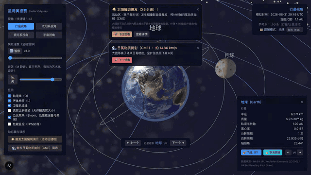
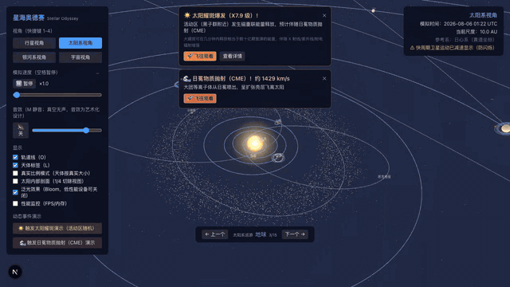
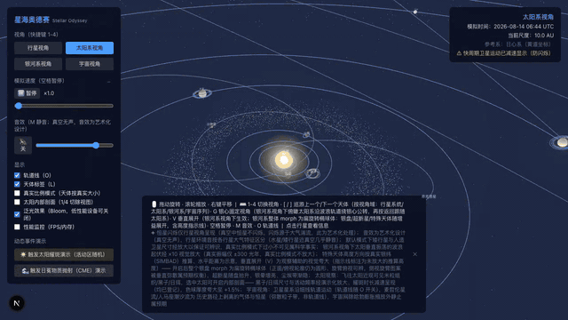

# 🌌 星海奥德赛 Stellar Odyssey

> **从行星表面到宇宙尽头的一次滚轮之旅。**
> 一个基于 React + Three.js 的多层级天体运动 3D 可视化系统：真实开普勒轨道驱动的太阳系、
> 体积渲染的发射星云与引力透镜黑洞、公版天文影像驱动的星系近观、43,000+ 真实星系构成的
> 宇宙大尺度背景——四个层级由滚轮连续缩放无缝贯通，配以随尺度渐变的空间音效，
> 是一场科学数据驱动的沉浸式宇宙遨游。

<p align="center">
  <a href="https://stellar.guushu.com"><strong>🚀 立即在线体验 → stellar.guushu.com</strong></a>
</p>

[](https://stellar.guushu.com)      

---

## 🎬 效果演示

**四层级连续缩放遨游**：滚轮从地球近观一路拉远，穿越太阳系、银河系，直抵可观测宇宙边界——



**太阳活动事件链**：触发太阳耀斑 → 飞往近观米粒组织与黑子 → 日冕物质抛射（CME）朝地球扑来——



**银河系—仙女座碰撞合并快进预览**：十几秒穿越 45 亿年，见证两大星系首次穿越、潮汐扭曲直至合并——



> 以上只是三条主线。**推近人马座 A\* 看引力透镜光子环、钻进体积渲染的猎户座星云、
> 飞抵由真实巡天影像驱动的仙女座星系、在 43,000+ 真实星系点云中环视宇宙网**——
> 更多新看点见下方亮点特性，或[直接开玩](https://stellar.guushu.com)。

---

## ✨ 亮点特性

### 🔭 四层级连续缩放遨游
- **行星视角 → 太阳系视角 → 银河系视角 → 宇宙视角**，按 `1`–`4` 一键切换，或用**滚轮从行星表面一路拉远到可观测宇宙边界**（半径约 465 亿光年），无需任何点击切换
- 缩放过程中内容 LOD 淡入淡出、时间压缩比对数插值、背景色与音景实时混合，HUD 显示当前尺度标尺（AU / 光年 / Mpc 自动切换）

### 🪐 真实物理驱动的太阳系
- 八大行星完整**开普勒轨道六要素**（NASA JPL 数据），求解开普勒方程满足匀面速度定律；初始相位基于 J2000 历元——**打开应用时行星位置与真实当前日期一致**
- 金星逆向自转、天王星 97.8° 侧躺、哈雷彗星 162° 逆行高离心率轨道近日点疾驰、小行星带/柯伊伯带每粒子独立开普勒剪切
- 20+ 卫星：月球潮汐锁定、伽利略四卫星 1:2:4 共振、ISS/哈勃/天宫 glTF 精细模型近观

### ☀️ 太阳活动系统
- 近观可见**米粒组织、黑子（11 年周期蝴蝶图纬度迁移）、日珥、光斑**；较差自转（赤道 25.4 天 / 极区 34 天）
- **耀斑与 CME（日冕物质抛射）**事件链：泊松自动触发 + 手动演示，CME 抵达地球触发极光增强
- **太阳内部剖面**：1/4 切除视图，核心/辐射区/对流区可点选科普

### 🌀 银河系与深空
- 3D 棒旋结构（4.3 万粒子银盘 + 密度波旋臂 + 尘埃带 + 银晕 + **HI 翘曲盘**），太阳系沿波浪轨道绕银心公转（银河年约 2.3 亿年，"You are here" 标记）
- 20+ 特殊天体基于真实原型逐一近观：人马座 A* 黑洞、蟹状脉冲星灯塔扫束、天狼星双星互绕、猎户座星云、昴星团、马头星云、类星体 3C 273……
- **超新星爆炸**四阶段动画（Sedov-Taylor 冲击波扩张 → 遗迹归档）；**垂直展开模式**（`V`）将整个银盘 morph 为椭球体观察真实银纬分布

### 🕳 体积渲染星云与引力透镜黑洞
- **raymarch 体积星云**（发射-吸收积分 + 3D 密度纹理 + 蓝噪声抖动）：猎户座 M42 扇贝状发射腔与四边形星团空腔、环状星云 M57 壳层、马头星云吸收暗云剪影、蟹状星云丝状遗迹 + 脉冲星风云环面/极向喷流、WR 124 星风抛射壳
- **黑洞引力透镜近观**：飞抵人马座 A* / 天鹅座 X-1 推近可见**光子环、背景星场弯曲、吸积盘温度黑体色 + 多普勒束流增亮 + 引力红移**；跟随 M87 推近还原 **EHT 2019 首张黑洞照片的近正视光子环**
- **恒星表面物理化**：Planck 黑体谱定色温（参宿四橙红 → 参宿七蓝白）、光谱型临边昏暗、时变对流米粒（巨星颗粒大而慢、矮星细密）、参宿四非对称巨对流胞与衍射星芒
- **帧率自适应质量档**：体积渲染按滑动窗 FPS 自动升降步数与渲染分辨率（半分辨率 RT 动态视口），低端设备平滑降档不跌帧

### 🎞 真实天文数据驱动的星系（离线烘焙管线）
- **公版影像驱动近观**：M31/M33/大小麦哲伦云由 DSS2 彩色巡天影像烘焙为密度/颜色/尘埃图组——近观粒子云的旋臂走向、尘埃暗带、恒星形成区与真实照片逐一对应（M31 按 77° 倾角反投影回盘面）
- **体积尘埃盘视线消光**：斜视/侧视 M31 时近侧尘埃带**真实遮挡**后方星光与核球辉光，消光随倾角物理增强
- **2MRS 真实巡天背景**：43,488 个真实星系的三维点云（2MASS 红移巡天，Huchra et al. 2012）——室女座团聚集、银道遮挡带、宇宙网纤维走向均为真实数据，全目录仅 2 次 draw call
- **昴星团 Gaia DR3 真实成员星**（600 颗，视差+自行共动选星）+ M13 球状星团 King 分布与 HR 图颜色
- 更多真实原型细节：M87 星系团环境（2,000 球状星团 + HST-1 类喷流节点 + 室女座团成员点缀）、LMC 30 Doradus 蜘蛛星云与中央棒、触须星系 N-body 潮汐尾、Abell 370 型引力透镜弧、GRB 221009A 相对论喷流与余辉膨胀壳、银河系**费米气泡**双极辉光

### 🌠 宇宙尺度演化
- 本星系群 → 室女座星系团 → 拉尼亚凯亚超星系团 → 宇宙网大尺度结构（真实 2MRS 点云 + 程序化纤维氛围层）
- **银河系—仙女座碰撞合并快进预览**：12 秒穿越 45 亿年，完整呈现首次穿越 → 潮汐扭曲 → 星暴 → 终态椭圆星系 Milkomeda
- 哈勃膨胀示意、麦哲伦星流、人马座潮汐流、可观测宇宙边界

### 🎧 沉浸式体验
- **Web Audio 程序化合成空间音效**：四层级音景随缩放等功率交叉混合，太阳轰鸣与黑洞嗡鸣 3D 定位（真空无声，音效为艺术化设计并已登记）
- 任意天体**点选 → 飞往 → 跟随**（2.5 秒平滑运镜），`[` / `]` 按视角域巡游序列逐个打卡（L1 行星系统 / L2 十五天体 / L3 十四站深空 / L4 八站星系）
- **真实比例模式**（`R`）：如实呈现"真实比例下行星几乎不可见"的尺度事实
- 控制面板选项按视角作用域智能显隐，Bloom 泛光后处理，60 FPS 满帧目标

---

## 🚀 快速开始

**在线体验**：直接访问 [stellar.guushu.com](https://stellar.guushu.com)，无需安装。

**本地运行**：

```bash
# 安装依赖
npm install

# 启动开发服务器（http://localhost:3000）
npm run dev

# 需要同时开第二个实例时（http://localhost:3100，独立构建目录，与上面互不干扰）
npm run dev:3100

# 生产构建与启动
npm run build
npm run start
```

打开浏览器后：**滚轮缩放**体验连续遨游，按 `1`–`4` 切换四大视角，**点击任意天体**查看信息并飞往观察。完整操作见 [docs/getting-started.md](docs/getting-started.md)。

> 建议使用支持 WebGL 2 的现代浏览器（Chrome / Edge / Firefox / Safari）。

## 📖 文档与教程

| 文档 | 内容 |
|---|---|
| [docs/getting-started.md](docs/getting-started.md) | 快速上手：安装运行、第一次遨游的推荐路线 |
| [docs/view-guide.md](docs/view-guide.md) | 四视角导览：每个层级能看什么、怎么玩 |
| [docs/controls.md](docs/controls.md) | 交互与快捷键完整参考、控制面板选项说明 |
| [docs/events-guide.md](docs/events-guide.md) | 动态事件演示：耀斑 / CME / 超新星 / 星系合并预览 |
| [docs/science-notes.md](docs/science-notes.md) | 科学性说明：真实数据来源与艺术化处理登记 |
| [docs/development.md](docs/development.md) | 开发指南：架构、测试、代码规范 |

## 🛠 技术栈

| 领域 | 技术 |
|---|---|
| 框架 | Next.js 14 · React 18 · TypeScript（strict） |
| 3D 渲染 | Three.js · React Three Fiber · 自定义 GLSL shader（对数深度缓冲跨尺度渲染 · raymarch 体积渲染 · 引力透镜 · 半分辨率 RT + 帧率自适应质量档） |
| 数据管线 | 离线烘焙脚本（`npm run bake:data`，零新依赖）：Gaia DR3 / SIMBAD / 2MRS / DSS2 影像 → `public/data/` 静态产物（约 2.5 MB，运行时零外部请求） |
| 状态管理 | Zustand |
| 音频 | Web Audio API（程序化合成 + PannerNode 3D 定位） |
| UI | Tailwind CSS |
| 测试 | Jest + React Testing Library（2951 用例 / 154 套件，覆盖率 gate ≥90%） |

## 📂 项目结构

```
src/
├── components/          # React 组件
│   ├── Scene/          # 3D 场景（银河系/宇宙/超新星/体积星云/引力透镜/星场……）
│   │   └── volumetric/ # 体积渲染基建（raymarch 材质/半分辨率 RT/黑洞透镜）
│   ├── CelestialBody/  # 天体（太阳/行星/卫星/彗星/特殊天体……）
│   ├── Camera/         # 相机控制与运镜
│   ├── UI/             # 控制面板/HUD/信息面板/通知
│   ├── Audio/          # 空间音效
│   └── dev/            # 开发预览工位（/dev/preview 独立天体调参验证页）
├── data/               # 天体数据（NASA JPL/SIMBAD 等来源逐项登记）
├── hooks/              # 自定义 Hooks（快捷键/相机/音效/细节层/烘焙数据加载）
├── utils/              # 纯函数逻辑（物理计算/尺度管理/事件域……单测覆盖）
├── types/              # TypeScript 类型定义
└── store/              # Zustand 全局状态
scripts/bake-data/      # 离线数据烘焙（Gaia/SIMBAD/2MRS/DSS2 → public/data/）
public/data/            # 烘焙产物（真实星表/影像图组/巡天目录，随仓库提交）
```

## 🧪 开发命令

```bash
npm test               # 运行全部单元测试
npm run test:coverage  # 测试覆盖率（gate ≥90%）
npm run type-check     # TypeScript 类型检查
npm run lint           # ESLint 检查
npm run format         # Prettier 格式化
npm run bake:data      # 重新烘焙真实数据产物（幂等；产物已提交，日常无需运行）
```

开发预览工位：`/dev/preview?body=orion-nebula`（体积星云/黑洞透镜/星系近观等 20+ 条目独立渲染 + 调参滑杆 + 质量档 HUD），完整说明见 [docs/development.md](docs/development.md)。

## 🔬 科学性承诺

所有天体物理参数基于真实科学数据（NASA JPL、SIMBAD、NED、USGS Astrogeology 等，数据来源在代码与信息面板中逐项登记）；轨道计算使用开普勒定律；**所有艺术化处理（尺寸夸大、时间压缩、音效设计等）均在应用内说明与代码注释中明确登记**。详见 [docs/science-notes.md](docs/science-notes.md)。

## 素材许可（Attribution）

- 天文星表与巡天数据（`public/data/` 烘焙产物，来源/许可/检索语句登记于各产物 meta 与 `scripts/bake-data/`）：
  - 昴星团成员星：ESA **Gaia DR3**（Gaia TAP，视差 + 自行共动选星 600 颗，ADQL 查询语句随快照登记）；
  - 宇宙大尺度背景：**2MASS 红移巡天 2MRS**（Huchra et al. 2012, ApJS 199, 26，VizieR J/ApJS/199/26，43,488 星系）；
  - 星系近观影像图组（M31/M33/LMC/SMC 密度/颜色/尘埃图与远景贴图）：**DSS2 彩色巡天**
    （STScI Digitized Sky Survey / AAO / ROE / Caltech，经 CDS **hips2fits** 服务切取烘焙；
    源图不入库，产物为派生权重图）；
  - 恒星物理参数/特殊天体位置：**SIMBAD** 及逐天体文献（Joyce 2020、Kervella 2003、EHT 2019、
    Su et al. 2010、Levine et al. 2006、Piran 2004 等——应用内信息面板"数据来源"行逐项呈现）；
  - M13 King profile：Harris 星团目录（1996，2010 版）。
- `public/textures/` 下的行星/月球/太阳表面纹理（2K 底图与 `4k_*` 近观细节层）与土星环纹理来自
  [Solar System Scope Textures](https://www.solarsystemscope.com/textures/)，
  许可协议 [CC BY 4.0](https://creativecommons.org/licenses/by/4.0/)（基于 NASA 观测数据制作）。
  4K 细节层由 SSS 8K 源图本地降采样至 4096×2048（P4）；官方对天王星、海王星、土星环仅提供 2K 源图，
  相应贴图维持 2K。`4k_sun.jpg`（S1 太阳近观层）：SSS 官方"8K"下载实为 4096×2048（与木星/土星情况
  一致，已核实），直接采用。纹理清单与代码内登记见 `src/data/textures.ts`；加载失败时自动降级为程序化纹理
  （`src/components/CelestialBody/proceduralTextures.ts`）。
- 法线贴图（P4 近观立体细节，本仓库由公开高程数据转换生成）：
  - `4k_earth_normal.jpg`：NASA Earth Observatory
    [GEBCO 全球地形图](https://visibleearth.nasa.gov/images/73934/topography)（公有领域）转换；
  - `4k_moon_normal.jpg`：NASA SVS [CGI Moon Kit](https://svs.gsfc.nasa.gov/4720)
    LOLA LDEM 高程数据（公有领域）转换；
  - `4k_mars_normal.jpg`：降级路径——无可获取的轻量 MOLA DEM（USGS 全分辨率 11 GB），
    由火星 4K 色彩贴图亮度推导生成（登记于 REQUIREMENTS.md §4.7）。
- 彗核形状参数（哈雷 15×8 km 花生形）依据 ESA Giotto 任务观测数据（`src/utils/cometNucleus.ts` 登记）。
- 矮行星真实贴图（P5，公有领域，本地降采样至 2K 底图 2048×1024 + 4K 近观层 4096×2048）：
  - `2k_pluto.jpg` / `4k_pluto.jpg`：NASA New Horizons LORRI/MVIC
    [全球拼接彩色地图](https://www.nasa.gov/image-feature/pluto-global-color-map)
    （NASA / Johns Hopkins University APL / Southwest Research Institute，公有领域）；
    南纬约 30° 以南为黑色未测绘区（飞掠时处于极夜，科学事实）；
  - `2k_ceres.jpg` / `4k_ceres.jpg`：NASA Dawn FC 全球拼接图（USGS Astrogeology
    Ceres_Dawn_FC_DLR_global_20ppd_Oct2015，https://planetarymaps.usgs.gov/mosaic/ 托管，
    NASA / JPL-Caltech / UCLA / MPS / DLR / IDA，公有领域）；
  - `4k_pluto_normal.jpg`：USGS Astrogeology
    Pluto_NewHorizons_Global_DEM_300m_Jul2017（公有领域，620 MB 源数据本地转换）；
    未测绘半球置平（与彩色贴图黑色未测绘区一致），测绘区边缘噪声经模糊 +
    梯度钳制抑制（残余粗糙感属源 DEM 立体像对不确定度）；
  - `4k_ceres_normal.jpg`：USGS Astrogeology
    Ceres_Dawn_FC_HAMO_DTM_DLR_Global_60ppd_Oct2016（公有领域，467 MB 源数据本地转换）；
  - 阋神星/鸟神星/妊神星无探测器实拍表面图，使用基于观测特征（反照率/颜色/光谱）的
    程序化增强纹理，艺术化推测部分登记于 `proceduralTextures.ts` 文件头。
- 人造卫星 glTF 精细模型（P7，`public/models/`，清单与登记见 `src/data/models.ts`）：
  - `iss.glb`：NASA 3D Resources
    ["International Space Station (ISS) (B)"](https://github.com/nasa/NASA-3D-Resources)
    （公有领域），本地经 gltf-transform 优化（weld/simplify + meshopt 压缩，190 KB / 3.2 万三角形）；
    源模型材质为统一灰色，运行时按网格形态启发式着色（帆板深蓝/桁架银灰/舱体白色，
    基于真实 ISS 外观的艺术化增强，登记于 `satelliteGeometry.ts` 文件头）；
  - `hubble.glb`：NASA 3D Resources "Hubble Space Telescope (A)"（公有领域），
    同上优化（168 KB / 5 千三角形）；
  - `geo-satellite.glb`：NASA 3D Resources "Tracking and Data Relay Satellites (TDRS) (B)"
    （公有领域，以 TDRS 为原型的静止轨道通信卫星示意），同上优化（305 KB / 1.6 万三角形）；
  - 天宫空间站：无 NASA 公版模型且未找到开放许可（CC0/CC BY）社区模型，
    按需求降级为程序化几何组合（T 字三舱构型 + 柔性太阳翼，
    `src/components/CelestialBody/satelliteGeometry.ts`）；
  - 全部模型仅近观懒加载（首屏无模型网络请求），加载失败静默降级为程序化几何组合。

## 📄 需求与变更记录

- 需求文档：[REQUIREMENTS.md](REQUIREMENTS.md)（含逐项实现状态与差异登记）
- 变更记录：[CHANGELOG.md](CHANGELOG.md)（Keep a Changelog 格式）

## 🤝 参与贡献

欢迎 issue 与 PR！请先阅读 [贡献指南](CONTRIBUTING.md)——代码贡献需签署 [CLA](CLA.md)（许可授予型，你保留自己贡献的版权），以维持本项目 AGPL-3.0 + 商业授权的双许可模式。

## ⚖️ 开源协议

本项目代码以 [GNU AGPL-3.0](LICENSE) 协议开源：

- **个人学习、教育教学、科研用途**：自由使用、修改与分发（遵循 AGPL 条款）
- **商业闭源集成**（如展馆展项、商业产品嵌入等不愿以 AGPL 开源衍生代码的场景）：请联系作者获取商业授权
- 纹理、3D 模型等素材的许可归属见上方「素材许可（Attribution）」一节，不适用代码协议
